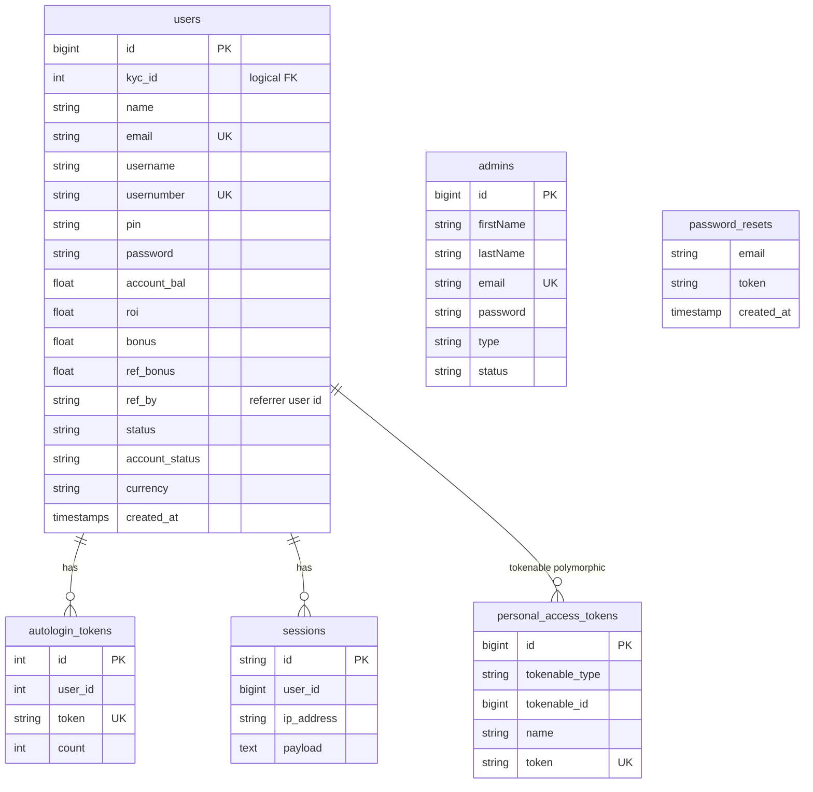
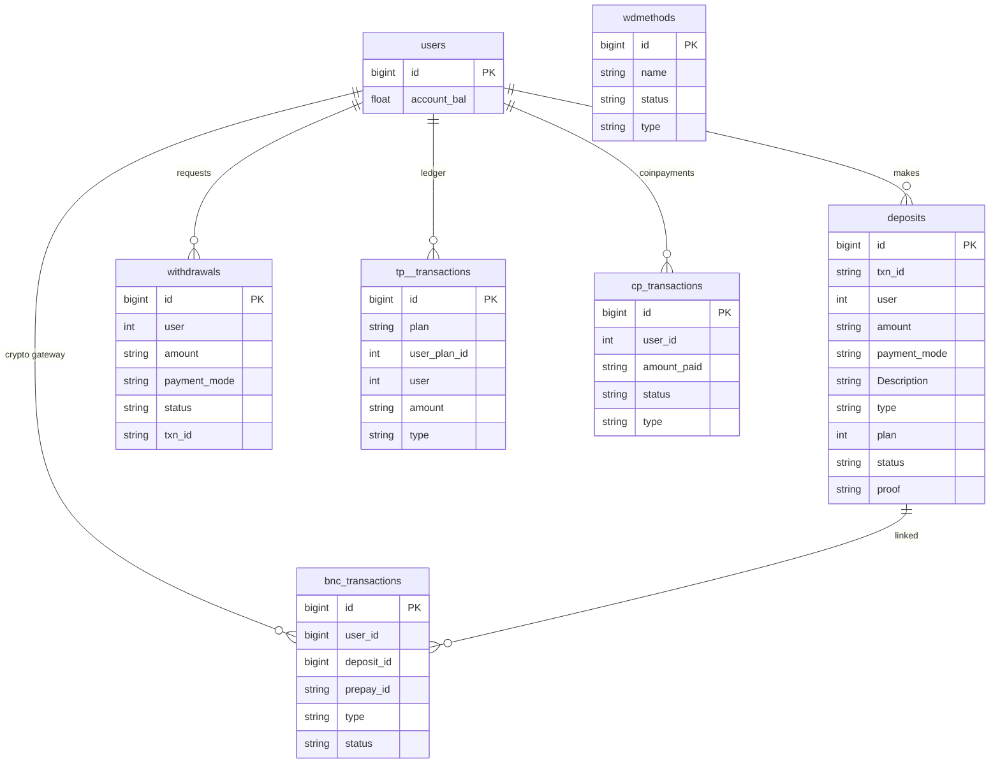
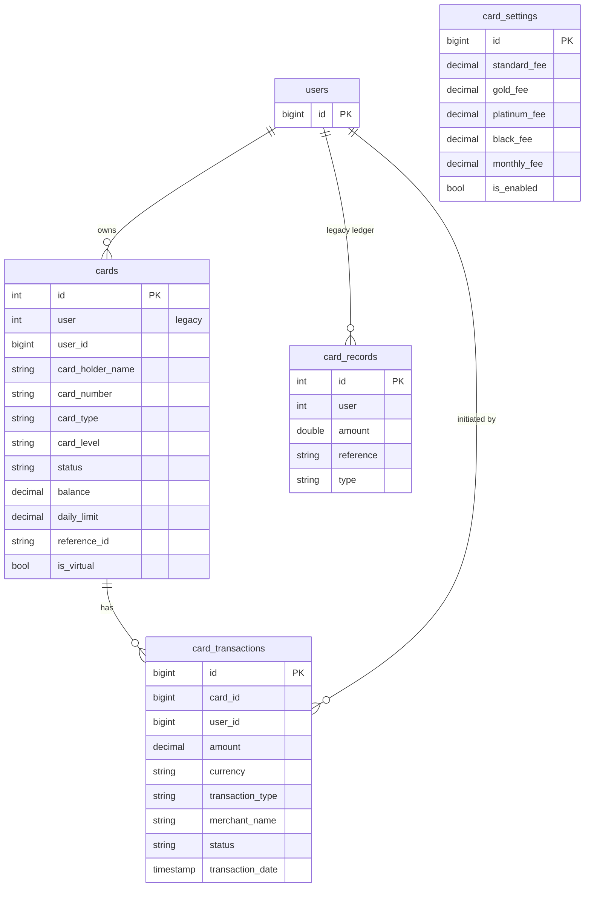
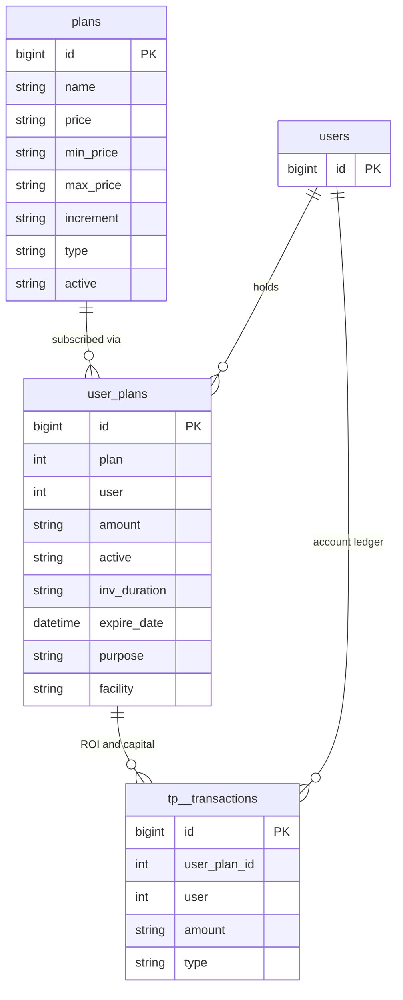
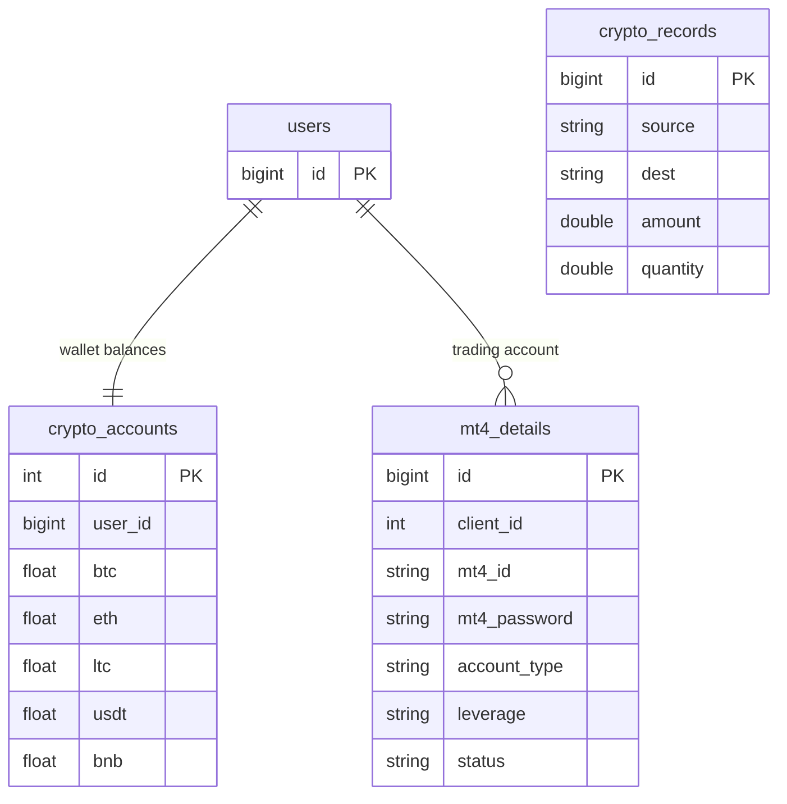
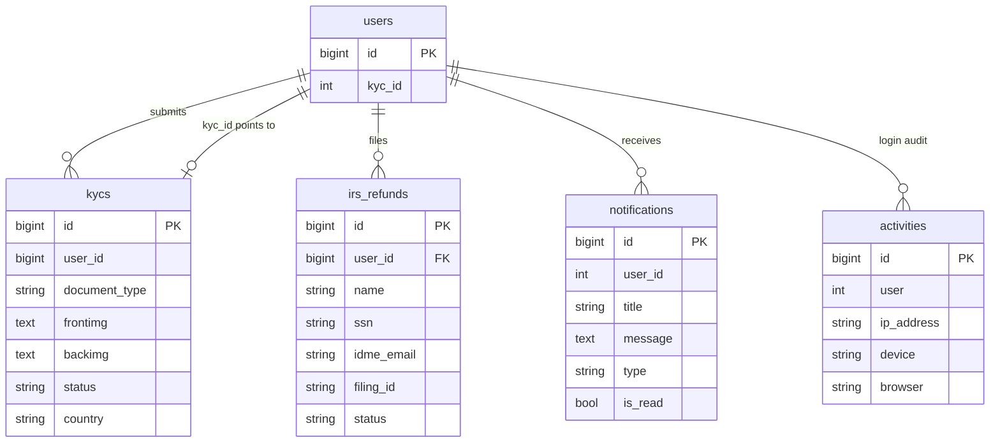
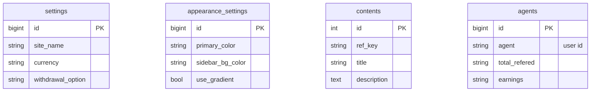

# GrandBank Database ER Diagram

Source: `bank_2026-07-04.sql` (39 tables)

> **Note:** Most relationships are **logical** (column naming convention) rather than enforced foreign keys. Only `irs_refunds.user_id → users.id` has a database-level FK constraint in the current dump.

---

## 1. High-level overview

```mermaid
erDiagram
    users ||--o{ deposits : "user"
    users ||--o{ withdrawals : "user"
    users ||--o{ cards : "user_id"
    users ||--o{ card_transactions : "user_id"
    users ||--o{ kycs : "user_id"
    users ||--o{ irs_refunds : "user_id FK"
    users ||--o{ notifications : "user_id"
    users ||--o{ activities : "user"
    users ||--o{ crypto_accounts : "user_id"
    users ||--o{ user_plans : "user"
    users ||--o{ tp__transactions : "user"
    users ||--o{ mt4_details : "client_id"
    users ||--o{ autologin_tokens : "user_id"
    users ||--o{ sessions : "user_id"
    users ||--o{ bnc_transactions : "user_id"
    users ||--o{ cp_transactions : "user_id"
    users ||--o{ card_records : "user legacy"
    users }o--o| kycs : "kyc_id"
    users }o--o| users : "ref_by referrer"

    cards ||--o{ card_transactions : "card_id"
    plans ||--o{ user_plans : "plan"
    plans ||--o{ deposits : "plan"
    user_plans ||--o{ tp__transactions : "user_plan_id"
    deposits ||--o{ bnc_transactions : "deposit_id"

    admins ||--|| admins : "standalone"
    card_settings ||--|| card_settings : "global config"
    appearance_settings ||--|| appearance_settings : "global config"
    settings ||--|| settings : "global config"
```

---

## 2. Users & authentication

---

## 3. Banking, deposits & withdrawals

---

## 4. Virtual cards

---

## 5. Investment plans & loans

---

## 6. Crypto & trading

---

## 7. KYC, compliance & notifications

---

## 8. CMS, settings & standalone tables

These tables have **no user foreign keys** — they store site content, configuration, or system data.

| Table | Purpose |
|-------|---------|
| `settings` | Main site/bank configuration (single row) |
| `settings_conts` | Contact & social settings |
| `appearance_settings` | Theme colors and UI customization |
| `contents` | CMS page blocks (key/value content) |
| `faqs` | FAQ entries |
| `testimonies` | Customer testimonials |
| `terms_privacies` | Legal text |
| `images` | Uploaded media metadata |
| `ipaddresses` | IP whitelist/blocklist |
| `paystacks` | Paystack payment config |
| `tasks` | Admin task tracker |
| `agents` | Referral agent stats (`agent` = user id) |
| `migrations` | Laravel migration history |
| `failed_jobs` | Queue failure log |

---

## 9. Full table list (39)

| # | Table | Primary key | Links to `users` |
|---|-------|-------------|------------------|
| 1 | activities | id | user |
| 2 | admins | id | — |
| 3 | agents | id | agent (string) |
| 4 | appearance_settings | id | — |
| 5 | autologin_tokens | id | user_id |
| 6 | bnc_transactions | id | user_id |
| 7 | card_records | id | user |
| 8 | card_settings | id | — |
| 9 | card_transactions | id | user_id |
| 10 | cards | id | user_id, user |
| 11 | contents | id | — |
| 12 | cp_transactions | id | user_id |
| 13 | crypto_accounts | id | user_id |
| 14 | crypto_records | id | — |
| 15 | deposits | id | user |
| 16 | failed_jobs | id | — |
| 17 | faqs | id | — |
| 18 | images | id | — |
| 19 | ipaddresses | id | — |
| 20 | irs_refunds | id | user_id (FK) |
| 21 | kycs | id | user_id |
| 22 | migrations | id | — |
| 23 | mt4_details | id | client_id |
| 24 | notifications | id | user_id |
| 25 | password_resets | — | — |
| 26 | paystacks | id | — |
| 27 | personal_access_tokens | id | polymorphic |
| 28 | plans | id | — |
| 29 | sessions | id | user_id |
| 30 | settings | id | — |
| 31 | settings_conts | id | — |
| 32 | tasks | id | — |
| 33 | terms_privacies | id | — |
| 34 | testimonies | id | — |
| 35 | tp__transactions | id | user |
| 36 | user_plans | id | user |
| 37 | users | id | ref_by → users |
| 38 | wdmethods | id | — |
| 39 | withdrawals | id | user |

---

## Viewing options

1. **In Cursor / GitHub** — open this file; Mermaid blocks render automatically.
2. **dbdiagram.io** — import `database/schema.dbml` for an interactive diagram.
3. **MySQL Workbench** — reverse-engineer from a live `bank` database for FK-aware diagrams.
